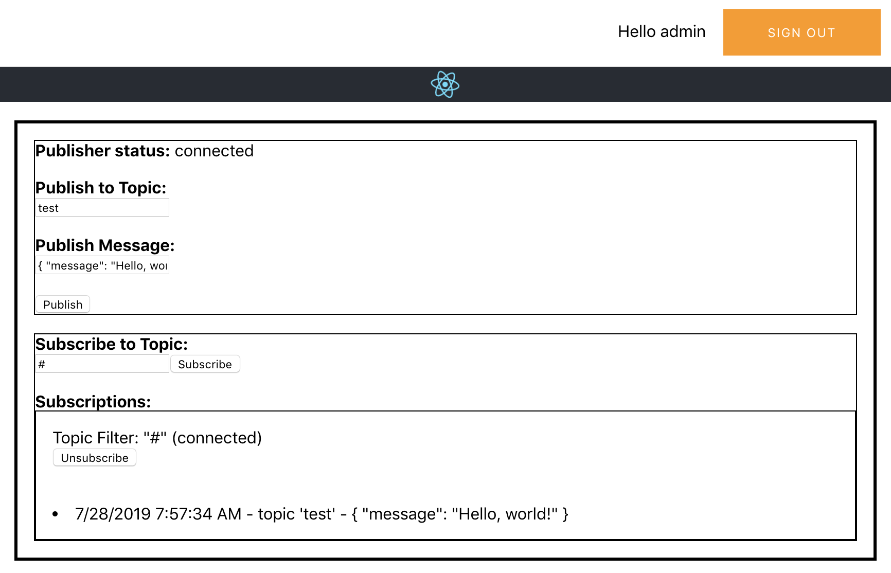
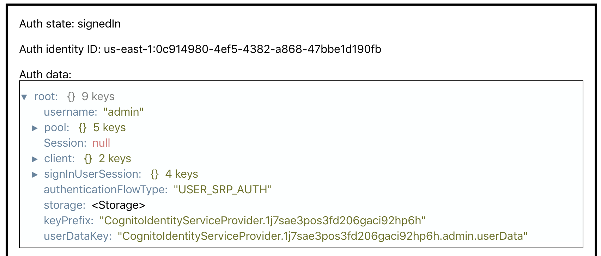

# aws-amplify-react-iot-pub-sub-using-cp

## Overview

This is a very basic AWS Amplify + NodeJS API + Lambda function + AWS IoT Javascript SDK + React project that combines basic authentication via Amazon Cognito with AWS IoT Core pubsub via the aws-iot-device-sdk

(1) allows user to signup, signin and signout
(2) when user signs up, it creates Cognito user pool and Identity pool.
(3) when a user signs-in, authenticate via Cognito, it creates IoT policy and attaches with the cognito identity and allows the user perform pub/sub using that identity
(4) subscribe to one or more topics and 
(5) publish messages to a user-specified topic. 

The functionality is similar to (though simpler, less pretty) version of the "Test" tab in the AWS IoT console:
 
## Prerequisites

Refer: https://docs.amplify.aws/start/getting-started/installation/q/integration/js

1. Before we begin, make sure you have the following installed:
    Node.js v12.x or later
    npm v5.x or later
    git v2.14.1 or later

2. Install amplify cli
    
   npm install -g @aws-amplify/cli
   
3. Create IAM user in your AWS account

   a. Login to IAM console
   b. Go to "Users" and click "Add User", select both access types (copy the access key, secret key and the console password)

4. Configure Amplify to use your AWS account

   amplify configure
   
   Example:
   
   Sign in to your AWS administrator account:
   https://console.aws.amazon.com/
   Press Enter to continue
   
   Ignore the browser and hit enter in the shell
   
   Specify the AWS Region: us-east-1
   Specify the username of the new IAM user:
   ? user name:  <iam user your created above>
   Complete the user creation using the AWS console
   https://console.aws.amazon.com/iam/home?region=us-east-1#/users$new?step=final&accessKey&userNames=iotsampleappuser&permissionType=policies&policies=arn:aws:iam::aws:policy%2FAdministratorAccess
   Press Enter to continue
   
   Enter the access key of the newly created user:
   
   ? accessKeyId:  <enter access key copied from above step>
   ? secretAccessKey:  <enter secret key copied from above step>
   
   This would update/create the AWS Profile in your local machine
   ? Profile Name:  <profile name> #copy the profile name you will need it later

 
## Screenshots




##  Local Deployment (website on localhost)

1. Clone the repo

  ```sh
  git clone https://github.com/matwerber1/aws-amplify-react-iot-pub-sub-using-lambda
  ```

2. move to project root

  ```sh
  cd aws-amplify-react-iot-pub-sub-using-lambda
  ```

3. Install dependencies

```sh
npm install
```

2. Initialize Amplify

  ```sh
  amplify init
  ```

Note: It is recommended to run this command from the root of your app directory
? Do you want to use an existing environment? Yes
? Choose the environment you would like to use: (Use arrow keys)
❯ lambdatest
? Select the authentication method you want to use: AWS profile
? Please choose the profile you want to use <select the profile you created above>

3. Push / create your backend

  ```
  amplify push
  ```

? Are you sure you want to continue? Yes

4. Navigate to the [AWS IoT web console](https://console.aws.amazon.com/iot/home?) and:

  1. Click **Settings** in the lower left, and copy your **Endpoint** to a text file; you'll need this later. It would look similar to below:

    ```
    a6l17n41bqjml-ats.iot.us-east-1.amazonaws.com
    ```

5. Navigate to the [Cognito Co thensole](https://console.aws.amazon.com/cognito/home?) and:

  1. Click **Manage Identity Pools** (not user pools)
  2. Click the pool name for your app, it should look similar to `cognito81d9f49f_identitypool_81d9f49f_lambdatest`
  3. Copy the **Sample Code** link on left, and in the code example, copy your **Identity Pool ID** to a text file; you'll need this later. It will look like `us-west-2:970761d2-56b8-4057-9eb6-f7e01cd9ade6`

2. Open `src/aws-iot-configuration.js` and:

  1. set the **endpoint** to the value from above. Be sure to prefix the endpoint value with `wss://` (for websockets) and add a suffix of `/mqtt`, as in the example below. 
  
  2. Set the **host** to the endpoint value as-is.
  
  3. Specify your AWS **region**

  4. Set the pool ID to the Cognito Pool ID you gathered from above. 

  ```js
  // src/aws-iot-configuration.js
  var awsIotConfiguration = {
    endpoint: 'wss://a6l1346n41bqjml-ats.iot.us-east-1.amazonaws.com/mqtt', 
    region: 'us-east-1',
    poolId: 'us-east-1:aed927b24-956f-44d6-a0bc-8ddf0a9fd813',
    host: 'a6l1346n41bqjml-ats.iot.us-east-1.amazonaws.com'
  };
  ```

7. Navigate to the [AWS IAM Console](https://console.aws.amazon.com/iam/home?#/roles) and search for the IAM role for your authorized Cognito Identity pool users. 
It will have a name similar to `arn:aws:iam::123456790:role/amplify-awsamplifyreacttempl-lambdatest-115859-authRole` and have a creation time that matches the date your deploying this project. Be sure to select the `authRole`, not the `unauthRole`

  1. Click **Add Inline Policies**
  2. Add the following policy
  ```
{
    "Version": "2012-10-17",
    "Statement": [
        {
            "Effect": "Allow",
            "Action": [
                "iot:Connect",
                "iot:Publish",
                "iot:Subscribe",
                "iot:Receive"
            ],
            "Resource": [
                "*"
            ]
        }
    ]
}
```

8. Now add permissions to the lambda function to call Iot Core to create and attach policy
Select role with name `awsamplifyreacttemplLambdaRole06f6bdec-lambdatest`

    1. Click **Add Inline Policies**
    2. Add the following policy
    ```
   {
       "Version": "2012-10-17",
       "Statement": [
           {
               "Effect": "Allow",
               "Action": [
                   "iot:CreatePolicy",
                   "iot:GetPolicy",
                   "iot:AttachPolicy"
               ],
               "Resource": [
                   "*"
               ]
           }
       ]
   }
   ```
4. Run the website locally

  ```
  npm run start
  ```

5. Navigate to `localhost:3000`, sign up, and test!